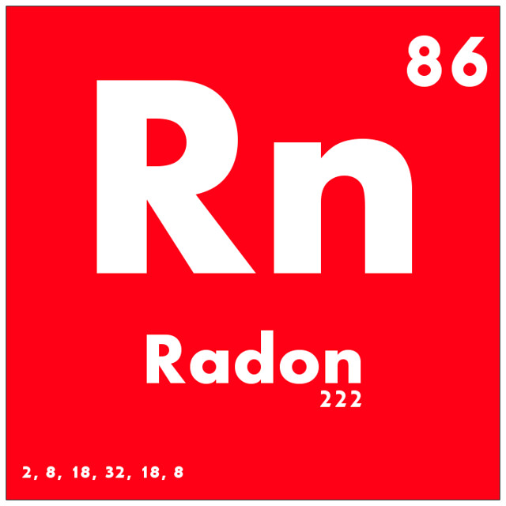

Syntax
======

Radon is a whitespace sensitive transpiled language mainly targetting C. 

Hello World
^^^^^^^^^^^

.. code-block:: c

  main(argc: Int32, argv: Ptr<String>): Int32 =
    Console::printf("Hello %s!", "World")
    return 0

Functions
^^^^^^^^^

Functions in radon are similar for the most part to C functions. Qualifiers like const and inline are vailable before the function name. Functions are a 1:1 mapping to C with the exception of functions inside a module which get their names mangled.

.. code-block:: c

  # Functions can span multiple lines
  shout(things: String): Int32 =
    Console::printf("%s!!!!", things)
    return String::length(things)

  # One line functions can be written on a single line
  things(this: String, that: String) = Console::printf("%s and %s", this, that)

  # parens can be omitted
  whoami: Console::puts("ASHLEY")

Modules
^^^^^^^

Modules namespace content under a specific name, begining with the `module` keyword and referenced via `::` for example

.. code-block:: c

  module Greeter =
    hello(who: String): Void = Console::printf("Hey %s", who);
  
  # Things outside module scope belong in a "Global" module.
  
  Greeter::hello("You")

Enums
^^^^^

Enums map to C enums for the most part 

.. code-block:: c

  enum Colours = 
    Red   = 0
    Green = 1
    Blue  = 2

  # Optionally the values can be omitted

  enum Colours =
    Red
    Green
    Blue

Structs
^^^^^^^

Structs also map very closely to their C counterparts 

.. code-block:: c

  struct Message =
    target: String
    hash: Int32

Tagged Unions
^^^^^^^^^^^^^

Tagged unions provide a convinient way to represent sum types, for example

.. code-block:: c

  union UserState = 
    LoggedIn(id: Int32)
    Banned(time: Long)
    LoggedOut

the code above defines a type `UserState` which can be constructed by any of the 3 proceeding constructors. 

Pattern Matching
^^^^^^^^^^^^^^^^

.. code-block:: c

  val showAvatar: Bool =
    match userState = 
      case LoggedIn(_) -> True
      case Banned(_)   -> True
      case LoggedOut   -> False

Type aliases
^^^^^^^^^^^^

.. code-block:: c

  type String = Ptr<Char>

Importing/Aliasing
^^^^^^^^^^^^^^^^^^

.. code-block:: c
  
  import C stdio

  alias C prontf(const char *format, ...) printf

Loops
^^^^^

Control Flow
^^^^^^^^^^^^

Inline Language Blocks
^^^^^^^^^^^^^^^^^^^^^^

Documentation Tags
^^^^^^^^^^^^^^^^^^

